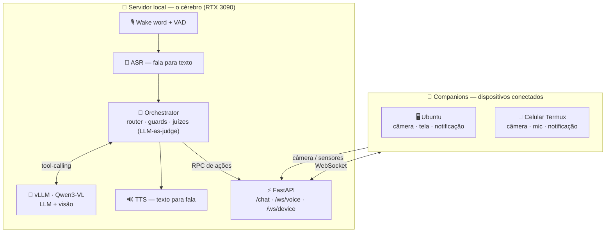

# brazaia 🧠🎙️

> Agente de IA **local**, **multimodal** e **distribuído** — um assistente de voz que roda 100% na própria máquina (LLM + visão + voz), sem depender de nuvem.


**brazaia** é um assistente pessoal *voice-first* que roda um **LLM multimodal (Qwen3-VL) localmente via vLLM** e atua sobre **dispositivos conectados** (notebook, celular): tira foto, lê a câmera, mostra conteúdo na tela e envia notificações — por comando de voz. O diferencial não é "chamar uma API de LLM", e sim uma **camada de orquestração própria** que planeja, executa ferramentas, valida honestidade e se auto-corrige.

---

## 🏗️ Arquitetura

Um **cérebro central** (servidor) coordena vários **dispositivos conectados** (companions). O usuário fala; o agente entende, decide, age nos dispositivos e responde por voz.



- **Servidor (o "cérebro"):** FastAPI + vLLM (Qwen3-VL) numa RTX 3090 — faz *wake word*, ASR/TTS e roda o **orchestrator**.
- **Companions (dispositivos):** clientes leves (Ubuntu, celular via Termux) que se conectam por **WebSocket** e expõem capacidades (câmera, tela, notificação); o servidor despacha ações por **RPC**.
- **Ativação por voz:** a *wake word* (`braza`) acorda o agente → captura → transcrição → agente → resposta falada.

---

## ✨ Features

- 🎙️ **Voz-first** — *wake word* (openWakeWord), VAD, ASR e TTS: conversa por voz ponta a ponta.
- 👁️ **Multimodal** — o agente **enxerga** (câmera dos devices) e **renderiza** matemática/páginas na tela (KaTeX).
- 🧩 **Orquestração própria de ferramentas** — um *planner* monta o plano, o LLM chama as tools, e **juízes (LLM-as-judge)** + **guards** garantem **honestidade** e **anti-alucinação**.
- 📡 **Multi-device** — um cérebro central, vários dispositivos conectados via WebSocket.
- 🧱 **Arquitetura hexagonal** — `api → application → domain ← infrastructure`, com contratos (`Protocol`) checados por **pyright**.
- ⚡ **100% local** — vLLM + **quantização (AWQ/FP8)**, gestão de contexto e **KV-cache**.

---

## 🔁 Como o agente pensa (o loop)

1. O **router** monta um plano de ferramentas a partir do pedido do usuário.
2. O **LLM** escolhe a próxima ação (*tool-calling* nativo).
3. **Guards** determinísticos validam pré-condições (device online? `image_id` válido?).
4. **Juízes (LLM-as-judge)** avaliam divergências, omissões e a **honestidade** do turno — com auto-correção ancorada.
5. A ação executa (no servidor ou **despachada a um device**); o resultado volta ao contexto.
6. No fim, um **turn-judge** confere, com base nos resultados reais, se o pedido foi de fato cumprido.

---

## 🛠️ Stack

| | |
|---|---|
| **Backend** | Python · FastAPI · asyncio · WebSockets |
| **IA / LLM** | vLLM · Qwen3-VL · tool-calling · RAG · quantização (AWQ/FP8) |
| **Voz / Visão** | openWakeWord · ASR · TTS · VAD · KaTeX |
| **Infra / Qualidade** | Tailscale · pytest · pyright · `uv` |

---

## 📂 Estrutura

```
api/             camada HTTP/WebSocket (FastAPI)
application/     orchestrator, juízes, serviços, guards
domain/          entidades, contratos (Protocol), exceções
infrastructure/  vLLM client, gateway de devices, voz, visão, render
companion/       cliente leve que roda nos dispositivos
```

---

## 🚀 Setup

Requer **Python 3.12+**, [`uv`](https://docs.astral.sh/uv/) e um endpoint **vLLM** servindo um modelo Qwen3-VL.

```bash
uv sync --dev                 # cria .venv e instala deps
cp .env.example .env          # configure VLLM_BASE_URL, MODEL_NAME, etc.

uv run uvicorn main:app --host 0.0.0.0 --port 8080 --reload
curl -s localhost:8080/api/v1/health
```

Type-checking (mesmo motor do Pylance):
```bash
uv run pyright
```

---

<sub>Projeto pessoal de pesquisa em agentes de IA aplicados — arquitetura, orquestração de ferramentas e multimodalidade local.</sub>
